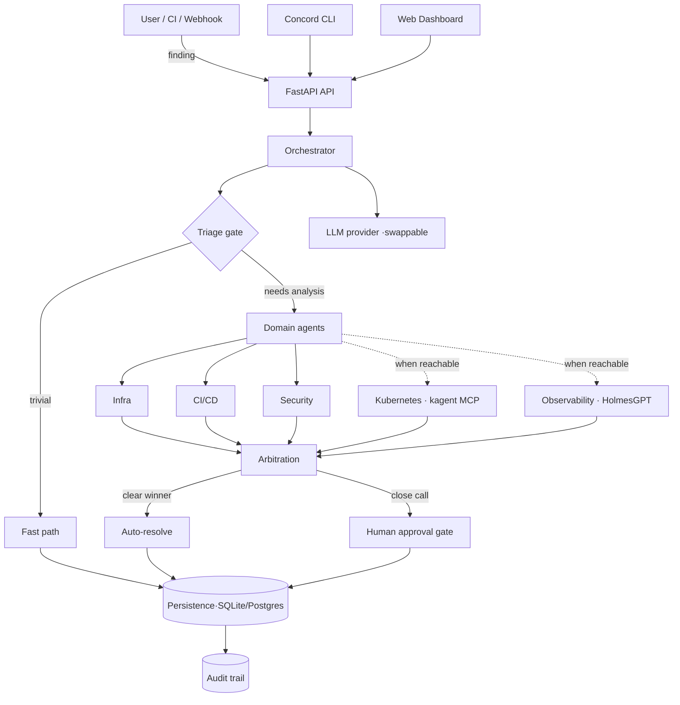

<p align="center">
  
</p>

<h1 align="center">Concord</h1>

<p align="center">
  <strong>One AI brain across your entire DevSecOps stack.</strong>
</p>

<p align="center">
  A self-hosted platform that triages security findings, runs domain agents,
  arbitrates their results with a deterministic confidence model, and keeps a
  human in the loop for consequential actions — with a full audit trail.
</p>

---

## What Concord is

Concord ingests security findings (from CI/CD, IaC scans, webhooks, or its own
scanners), decides whether each one is trivial enough to fast-path or needs
deeper analysis, runs the relevant **domain agents**, and **arbitrates** their
competing conclusions using a deterministic confidence score. Low-confidence
ties are escalated to a **human approval gate** rather than auto-resolved.
Every decision — fast-path or AI-path, approval or rejection — is written to a
durable, correlation-tagged **audit trail**.

It is designed to orchestrate existing security tools over the Model Context
Protocol (MCP), not replace them.

### Why it exists

Security teams drown in findings from a dozen disconnected tools, each with its
own console and confidence heuristics. Concord gives them one triage brain: a
consistent, auditable pipeline that decides what matters, explains why, and only
interrupts a human when a decision genuinely needs one.

---

## Key principles (enforced in code and tests)

- **Deterministic confidence** — `confidence = severity_weight × source_reliability`.
  Never LLM self-reported. This is what arbitration ranks on.
- **Everything is audited** — every finding, including fast-path, produces an
  audit record. Human approvals and rejections are audited too.
- **Scoped credentials** — per-connector tokens via the credential broker; no
  master credential.
- **Swappable LLM** — the provider is chosen by `LLM_PROVIDER`; provider details
  never leak into the orchestration logic.
- **Human-in-the-loop** — consequential/tie-break outcomes require explicit
  human approval; nothing destructive happens silently.

---

## Architecture



### Layers

| Layer | Location | Responsibility |
|-------|----------|----------------|
| MCP runtime | `core/mcp_runtime/` | Transport (TLS/mTLS), registry, audit |
| Orchestrator | `core/orchestrator/` | Triage → agents → arbitration → LLM → store |
| Domain agents | `agents/<domain>/` | Each wraps a backing scan/tool with a contract |
| Connectors | `connectors/tools.yaml` | Declarative external tools, orchestrated not replaced |

### Request/execution flow

1. A finding arrives (API, webhook, CLI, or a scan).
2. The **triage gate** applies rules (severity, known patterns, dedup). Trivial
   findings take the **fast path** — no LLM call.
3. Otherwise domain agents analyze it; each returns a structured result and a
   deterministic confidence score.
4. **Arbitration** ranks the agents. A clear winner auto-resolves; a close call
   (small confidence gap) becomes a **pending approval**.
5. The result and an **audit record** (tagged with the request correlation ID)
   are persisted.
6. A human approves or rejects pending items; stale ones can be expired.

---

## Features

- **Triage + arbitration** with a deterministic confidence model.
- **Domain agents**: Infra (Terraform), CI/CD (Kubernetes manifests) and
  Security (source code) run Concord's built-in pattern scanners. Kubernetes
  (kagent over MCP) and Observability (HolmesGPT REST) clients are implemented
  and run whenever their backend answers a live probe; otherwise they are
  reported **blocked** with the reason and skipped. They have **not yet been
  verified against live kagent / HolmesGPT** — see `docs/AGENTS_SETUP.md`.
- **Repository scan**: clones/updates the target repo (default
  `crms-devops/crms`), runs every available agent, one finding per commit —
  re-scanning an unchanged commit adds an audit entry, not a duplicate.
- **Persistence**: durable SQLite by default; **PostgreSQL** backend selected
  automatically when `CONCORD_DATABASE_URL` is set, with graceful fallback.
- **Auditable approvals**: approve, reject, and expire flows — all durable and
  audited; a pending-approvals queue.
- **Security**: API-key auth (fail-safe dev mode), TLS/mTLS transport,
  prompt-injection sanitization on untrusted tool output, dedup.
- **Observability**: structured (JSON) logging and request **correlation IDs**
  threaded from the API into logs and audit records.
- **Interfaces**: a web dashboard (Overview, Findings with per-agent detail and
  audit timeline, Approvals, Incidents, Security, Audit, Settings — all live API
  data, keyboard shortcuts `1`–`7`, `j`/`k`, `/`, `r`) and a CLI with human and
  `--json` output.

---

## Quickstart

### Local (Python)

```bash
python -m venv .venv && . .venv/bin/activate      # Windows: .venv\Scripts\Activate.ps1
pip install -r requirements/dev.txt
cp .env.example .env                               # then edit as needed

uvicorn api.main:app --reload --port 8000 --env-file .env   # the app itself does not read .env
# open http://localhost:8000  (dashboard)
```

Trigger a demo finding through the pipeline:

```bash
python concord_cli/main.py invoke -s CRITICAL
python concord_cli/main.py findings --json
python concord_cli/main.py audit
```

### Docker

```bash
# Set POSTGRES_PASSWORD in .env first (required; no weak default).
docker compose up --build
```

The image is multi-stage, runs as a non-root user, and has a health check.

---

## Configuration

All configuration is via environment variables (see `.env.example`). Highlights:

| Variable | Purpose |
|----------|---------|
| `LLM_PROVIDER` | Which LLM backend to use (swappable). |
| `CONCORD_API_KEY` | Enables API auth. Unset = open dev mode (logged). |
| `CONCORD_DB_PATH` | SQLite path (default backend). |
| `CONCORD_DATABASE_URL` / `POSTGRES_URL` | Use PostgreSQL; falls back to SQLite if unreachable. |
| `REDIS_URL` | Enables Redis-backed dedup; falls back to in-memory. |
| `CONCORD_LOG_FORMAT` | `json` for structured logs, else human text. |
| `CONCORD_ALLOW_INSECURE_TRANSPORT` | Allow plaintext MCP URLs (dev only). |
| `WEBHOOK_SECRET` | HMAC secret for the GitHub webhook. |

> If `POSTGRES_URL` is set but no database is running, the app falls back to
> SQLite **at startup** (one short timeout at boot). Comment it out to skip
> Postgres entirely.

---

## CLI

```
concord health                 # API health + auth posture
concord findings [--json]      # recent findings + stats
concord audit [--json]         # audit trail with correlation IDs
concord approvals              # pending human decisions
concord approve <id> <agent>   # resolve a tie-break
concord reject <id>            # reject a pending finding
concord invoke -s CRITICAL     # run the pipeline on a demo finding
concord agents                 # domain agents: active, or blocked + reason
concord scan [--no-wait]       # scan the configured repository
concord scan-status            # current / last scan
concord finding <id>           # per-agent analysis + audit timeline
concord stats | diagnostics
```

Exit codes: `0` ok · `1` the API refused the request (reason printed) · `2`
API unreachable.

`--json` (or `CONCORD_OUTPUT=json`) emits pure JSON for scripting; colour is
disabled automatically when output is piped.

---

## API

| Method | Path | Purpose |
|--------|------|---------|
| GET | `/health` | Liveness + auth posture |
| GET | `/findings/` | Findings + stats |
| GET | `/findings/{id}` | One finding |
| GET | `/findings/{id}/detail` | Finding + per-agent analyses + audit timeline |
| GET | `/findings/severity` | Counts by severity |
| GET | `/findings/incidents` | Findings grouped by artifact |
| GET | `/agents/` | Agents with live status (active / blocked + reason) |
| GET | `/events/scan-status` | Current / last scan |
| GET | `/audit/` | Audit trail |
| GET | `/events/approvals/pending` | Pending approvals |
| POST | `/events/findings/{id}/approve/{agent}` | Approve a tie-break |
| POST | `/events/findings/{id}/reject` | Reject a finding |
| POST | `/events/approvals/expire` | Expire stale approvals |
| POST | `/events/demo` | Run the pipeline on a demo finding (key-protected) |
| POST | `/events/scan-crms` | Trigger a repository scan |
| POST | `/events/github` | GitHub webhook (HMAC-verified) |

Data/state routes require the API key when `CONCORD_API_KEY` is set (the
dashboard asks for it and keeps it in `sessionStorage`). `/health`, `/version`,
`/`, and the HMAC-verified webhook are public by design. Approving or rejecting
anything that is not a pending tiebreak returns `409`.

---

## Deployment (Kubernetes / Helm)

```bash
helm lint helm/concord
helm template concord helm/concord | kubectl apply -f -
```

The chart ships hardened defaults: non-root pod/container security context,
read-only root filesystem, dropped capabilities, resource requests/limits,
liveness/readiness probes, and a least-privilege service account with the token
not mounted. Provide secrets via a Kubernetes Secret referenced by
`envFromSecret`.

---

## Testing

```bash
ruff check .
pytest tests/ -q -m "not slow"     # fast suite
pytest -m slow                     # real timeouts + live kagent/HolmesGPT (skip if absent)
```

The fast suite covers triage, arbitration, the scan route against a real local
git repo, every agent (including the kagent/HolmesGPT clients against a real
MCP SDK server), persistence, auth, transport security, sanitization, dedup,
the approval state machine, the CLI, and the Friday end-to-end flow
(`tests/integration/test_e2e.py`).

---

## Project structure

```
api/            FastAPI app, routes, middleware, dashboard
agents/         domain agents (infra, cicd, security, kubernetes*, observability*)
core/
  orchestrator/   triage → agents → arbitration → LLM → store
  arbitration/    deterministic confidence + resolver
  triage/         gate + rules (severity, patterns, dedup)
  persistence/    SQLite + PostgreSQL stores
  mcp_runtime/    transport (TLS/mTLS), registry, audit
  observability/  correlation IDs + structured logging
  credential_broker/  scoped per-connector tokens
concord_cli/    Typer CLI
connectors/     tools.yaml manifest
helm/ infra/    deployment assets
tests/          unit + integration
docs/           architecture, completion tracker
```
`*` external backends (kagent / HolmesGPT); blocked until reachable.

---

## Status

Concord is under active development. The triage/arbitration core, repository
scan, persistence, approvals, security controls, observability, CLI and
dashboard are implemented, tested and verified against a live API. The
Kubernetes and Observability agent clients are implemented and gated but have
not been run against live kagent / HolmesGPT yet (blocked on a local cluster —
`docs/AGENTS_SETUP.md`). Per-area status: `docs/PROJECT_COMPLETION.md`; audit
with evidence: `docs/AUDIT.md`.

## Contributing

See `CONTRIBUTING.md` and `DEVELOPMENT.md`. Before changing core behaviour, read
`CLAUDE.md` — it records the invariants above that must not be broken casually.

## License

See `LICENSE`.