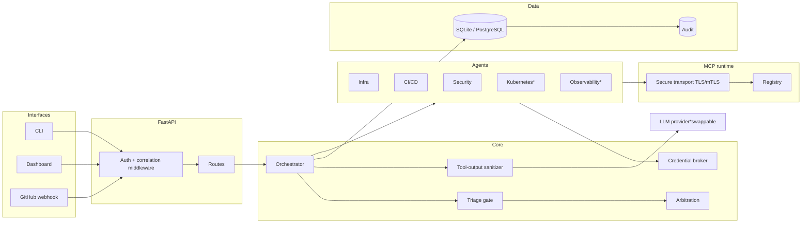
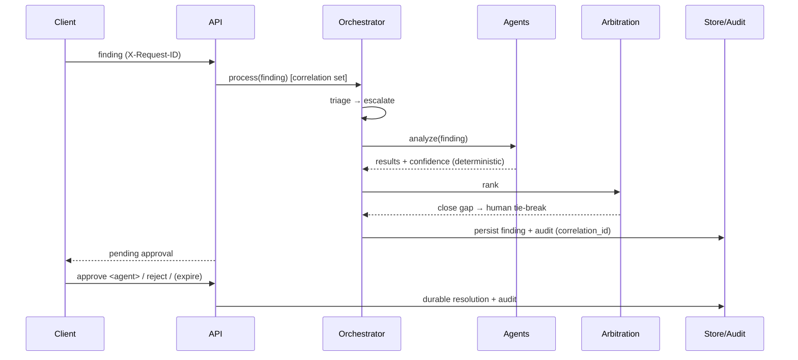

# Concord Architecture

This document describes how Concord is built and how a finding flows through it.
It reflects the **implemented** system; components that are scaffolded but not
yet wired to live services are marked *planned*.

## Component overview

`*` planned / scaffolded.

## Execution sequence (AI path with a tie-break)

## Design decisions

### Deterministic confidence
Arbitration ranks agents by `severity_weight × source_reliability`, defined in
`core/models/agent_response.py` and `core/arbitration/`. The LLM never
self-reports confidence; this keeps ranking reproducible and auditable.

### Persistence is swappable behind one accessor
`core/persistence/get_store()` returns a PostgreSQL-backed store when
`CONCORD_DATABASE_URL`/`POSTGRES_URL` is set and reachable, else SQLite. Both
implement the same method surface. Any connection failure logs a warning and
falls back to SQLite so a missing database never takes the platform down.

### Correlation IDs
The request middleware sets a `contextvars` correlation ID from `X-Request-ID`.
It propagates into deep code (orchestrator, persistence) without threading it
through call signatures, and is written onto every audit row and log line.

### Human-in-the-loop
Close arbitration calls become pending approvals rather than auto-resolving.
Approve/reject/expire are all durable and audited. Nothing destructive happens
without an explicit human decision.

### Security boundaries
- API-key auth guards data/state routes; fail-safe dev mode when unset.
- MCP transport verifies TLS by default; supports CA bundles and mTLS; refuses
  plaintext unless explicitly opted in.
- Untrusted tool output is sanitized (control/zero-width/marker stripping,
  injection flagging, delimiting) before entering an LLM prompt.

## Directory map

See the "Project structure" section of the top-level `README.md`.