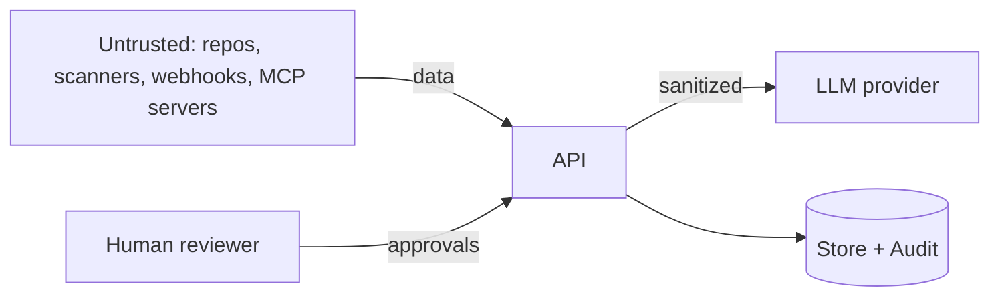

# Concord Threat Model

This document records the trust boundaries in Concord and the controls that
defend them. It reflects the implemented system; planned components are noted.

## Assets

- **Audit trail** — the record of every triage decision. Integrity matters most.
- **Connector credentials** — per-connector scoped tokens (no master secret).
- **Findings + their resolutions** — including human approvals/rejections.
- **The LLM prompt path** — untrusted tool output flows toward the model here.

## Trust boundaries

Everything entering from the left is **untrusted data**, never instructions.

## Threats and controls

| # | Threat | Control | Where |
|---|--------|---------|-------|
| T1 | Prompt injection / tool poisoning via scanner or connector output | Sanitize untrusted text (strip control/zero-width/markers, flag injection phrases, delimit) before it enters an LLM prompt | `core/orchestrator/context.py` |
| T2 | Unauthenticated access to data/state routes | API-key auth dependency; fail-safe dev mode logged loudly | `api/middleware/auth.py` |
| T3 | MITM / token theft on connector traffic | TLS verified by default; CA bundle + mTLS; plaintext refused unless opted in | `core/mcp_runtime/transport.py` |
| T4 | Credential sprawl / over-broad secrets | Per-connector scoped tokens via the broker; no master credential | `core/credential_broker/` |
| T5 | Silent or destructive automated action | Close arbitration calls require human approval; approve/reject/expire are audited | `api/routes/scan.py`, `core/orchestrator/` |
| T6 | Tampered or missing audit trail | Every decision (incl. fast-path) writes a durable, correlation-tagged audit record | `core/persistence/`, `core/observability/` |
| T7 | Confidence manipulation by the model | Confidence is deterministic (`severity_weight × source_reliability`), never LLM self-report | `core/arbitration/` |
| T8 | Supply-chain risk in CI | Pinned actions, least-privilege `permissions`, dependency audit | `.github/workflows/` |
| T9 | Webhook forgery | GitHub webhook verifies an HMAC signature (`WEBHOOK_SECRET`) | `api/routes/events.py` |

## Residual risk

- Sanitization (T1) is defense-in-depth, not a guarantee; it depends on the
  system prompt treating delimited content as data and on the human approval
  gate for consequential actions.
- The Kubernetes and Observability agents are planned; their MCP trust
  boundaries (T3) are designed for but not yet exercised end-to-end.
- SQLite (single-process) offers no row-level tamper protection; the PostgreSQL
  backend is recommended for multi-user deployments.

## Reporting

See `SECURITY.md`.